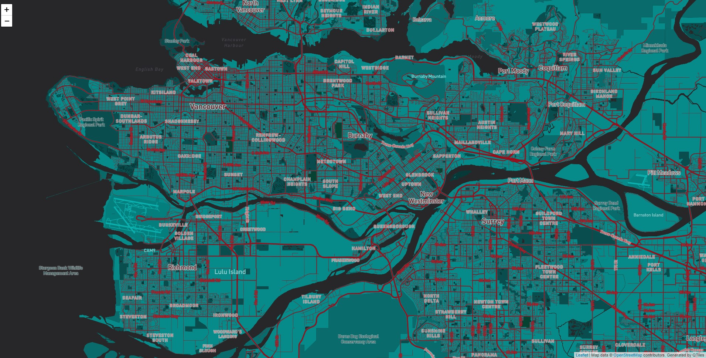
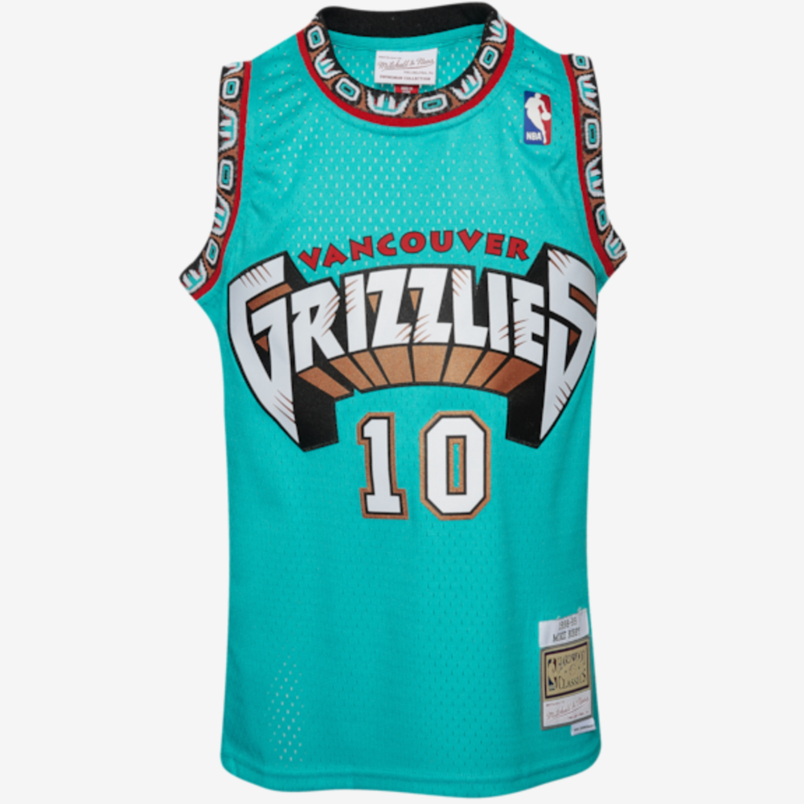

# Grizzlies Themed Map of Vancouver B.C.

### Exploring the use of sports team themed basemaps for use in marketing and fan experience.

As sports teams and front offices work to immerse consumers in the fan experience in all apsects of fan interaction, identifying simple changes to materials can bring added layer of depth to the immersion into the fan experience. This map offers up a simple conceptualization of a city specific basemap featuring themematic elements from the brand of a local sport team. Basemaps such as this one could be used in all aspects of fan interaction, including marketing, wayfinding, social media, and even gameday informational programs.

For this map, Vancouver, British Columbia was chosen as the city to represent, and then the (now defunct) Vancouver Grizzlies colors were used to idendtify the proper theme to accompany team materials in fan interaction. This process was started by dropping a picture of the team jersey into Mapbox Cartogram and then making modifications for legibility and aestehtic improvements. Below is an image of the map along with the image of the team jersey used to creat the basemap colors.

This map could utlize any zoom level, but for this specific map, the zoom level of 13 was chosen. This map may be more functional with an increased zoom level, due to small venue specific details that teams may want to highlight. However, for purposes of demonstration, this zoom level works well.
